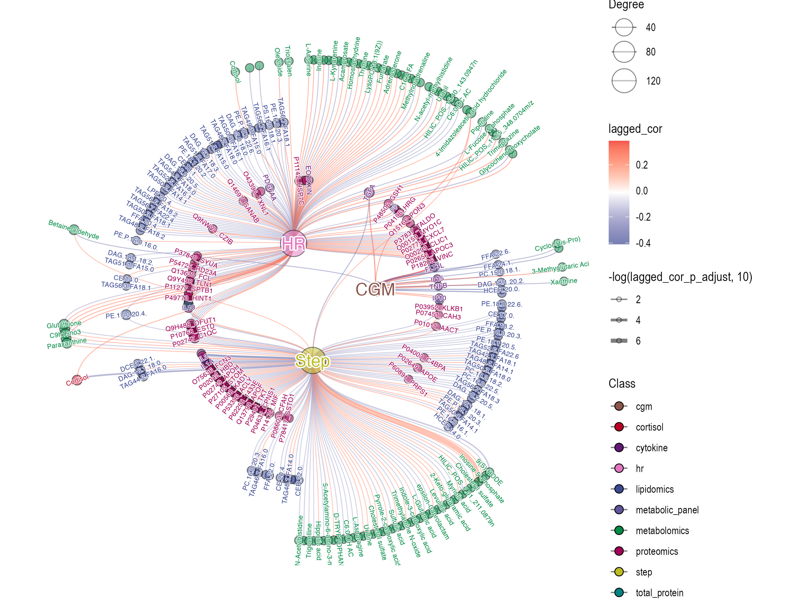

layout: true
background-image: url(images/lkc_logo.png)
background-position: 100% 0%
background-size: 20%
  
<div class="my-footer"><span>Xiaotao Shen/www.shen-lab.org</span></div> 

---


```{r setup, echo = FALSE, message = FALSE, warning = FALSE, include=FALSE}
knitr::opts_chunk$set(echo = FALSE, eval = FALSE, 
                      message = FALSE, cache = TRUE, dpi = 72)
library(tidyverse)
options(warn = -1)
```

```{r xaringan-themer, include = FALSE}
library(xaringanthemer)
# mono_dark(base_color = "green",
#           padding = 
#           background_color = "black",
#           text_color = "green",
#           link_color = "#eba134",
#           text_slide_number_color = "green",
#           inverse_background_color = "black",
#           inverse_text_color = "green",
#           inverse_header_color = "green",
#           header_font_family = google_font(family = "Lato"),
#           text_font_google = google_font(family = "Lato"),
#           code_font_google   = google_font("Droid Mono"),
#           header_h1_font_size = "30px", 
#           header_h2_font_size = "25px", 
#           header_h3_font_size = "20px",
#           text_font_size = "20px",
#           code_font_size = "1em",
#           table_border_color = "green",
#           table_row_border_color = "green", 
#           footnote_color = "green", 
#           footnote_font_size = "5px",
#           text_bold_color = "green",
#           header_color = "green"
#           )
mono_dark(base_color = "#cbf7ed", black_color = "white")
```

# About the class

-   **Instructor**: Xiaotao Shen (https://www.shen-lab.org/)

-   **Email**: xiaotao.shen@ntu.edu.stg

-   **WhatsApp**: +1 5712679283

-   **Github Repo**: https://github.com/jaspershen-lab/MD7115-NTU

-   **Reference**:

1.  [R for Data Science](https://r4ds.had.co.nz/)
2.  [R Graphics Cookbook](https://r-graphics.org/)
3.  [Network Analysis with R](https://www.amazon.com/Network-Analysis-R-Use/dp/3319238822)

---

# Introduction

In this course, we will learn how to use R to analyze and visualize data in the form of graphs, networks and trees. We will cover the following topics.

1. What is a graph, network and tree?

2. Their applications in biomedical research

3. How to use R to analyze and visualize them

4. Examples

---

# Preparation

We need to install some R packages before the class.

Some packages are in Bionconductor, so we need to install `BiocManager` first.

```{r, echo=TRUE, eval = TRUE}
if (!requireNamespace("BiocManager", quietly = TRUE)){
install.packages("BiocManager")
}
```

`tidyverse` is a collection of R packages designed for data science, and it includes `ggplot2`, which is a basic graph package for network and tree in R.

```{r, echo=TRUE, eval = TRUE}
if (!requireNamespace("tidyverse", quietly = TRUE)){
install.packages("tidyverse")
}
```

---

# Preparation

Some specific packages for graph and network.

```{r, echo=TRUE, eval = TRUE}
if (!requireNamespace("igraph", quietly = TRUE)){
install.packages("igraph")
}
if(!requireNamespace("ggraph", quietly = TRUE)){
install.packages("ggraph")
}
if(!requireNamespace("tidygraph", quietly = TRUE)){
install.packages("tidygraph")
}
if(!requireNamespace("ggnetwork", quietly = TRUE)){
install.packages("ggnetwork")
}
```

---

# Preparation

Some specific packages for tree analysis.

```{r, echo=TRUE, eval = TRUE}
if(!requireNamespace("ggtree", quietly = TRUE)){
BiocManager::install("ggtree")  
}
if(!requireNamespace("treeio", quietly = TRUE)){
BiocManager::install("treeio")  
}
if(!requireNamespace("ggtreeExtra", quietly = TRUE)){
BiocManager::install("ggtreeExtra")  
}
```

---

# What is a graph/network?

.pull-left[
A graph is a collection of nodes (vertices) and edges (links) that connect pairs of nodes.

A small undirected graph with numbered nodes.
]


.pull-right[

]

---

# Biological networks

-   Protein-protein interaction networks

-   Metabolic networks

-   Correlation network

-   Gene regulatory networks

-   Disease networks

-   Microbe-metabolite network

-   Drug-target networks

-   Signaling networks


---

# Protein-protein interaction networks

.pull-left[

Protein-protein interaction networks (PPIN) are mathematical representations of the physical contacts between proteins in the cell. 

* Node: protein

* Edge: interaction between proteins
]

.pull-right[
<div style="display: flex; justify-content: center; align-items: center;">
    
</div>

> Jeong et al. Nature 2001

]


---

# Metabolic networks

.pull-left[

A metabolic network is the complete set of metabolic and physical processes that determine the physiological and biochemical properties of a cell. As such, these networks comprise the chemical reactions of metabolism, the metabolic pathways, as well as the regulatory interactions that guide these reactions.


* Node: protein (enzyme and metabolites)

* Edge: chemical reactions

]

.pull-right[
<div style="display: flex; justify-content: center; align-items: center;">
    
</div>

> https://en.wikipedia.org/wiki/Metabolic_network

]

---

# Correlation networks


.pull-left[

Correlation networks are a way to represent and analyze the relationships between different biological entities (like genes, proteins, or metabolites) based on how their levels or activity change together across various samples or conditions. 


* Node: Each node in the network represents a biological entity (e.g., a gene, a protein, or a metabolite). 

* Edge: Edges connect nodes and represent the correlation between the entities they represent. The strength or weight of the edge indicates the strength of the correlation. 

Gene Co-expression Networks

]

.pull-right[
<div style="display: flex; justify-content: center; align-items: center;">
    
</div>

> Zhou et al. Cell Host & Microbe 2024

]


---

# Some important properties of a network

* Degree Distribution:

The distribution of the number of connections (or "degree") each node has in the network. 

* Shortest Paths:

The shortest path between two nodes in a network is the smallest number of edges that must be traversed to get from one node to the other.

* Centrality:

Measures the importance or influence of a node within the network, often based on the number of connections, shortest paths, or intermediate positions. 

* Betweenness Centrality:

A measure of how often a node appears on the shortest path between two other nodes in the network.


---

# Degree Distribution


.pull-left[
What is the degree of nodes?

Degree is the number of edges connected to a node.

In this network, node 3's degree is 3. node 1's degree is 1.

]


.pull-right[

]

---

# Scale-free networks


.pull-left[

A "scale-free network" refers to a network where the degree distribution, which is the distribution of the number of connections (or links) each node has, follows a power law. 

This means that a small number of nodes (the "hubs") have a very large number of connections, while the majority of nodes have relatively few connections. 

In biological network, scale-free networks are common, with a few highly connected nodes (hubs) and many nodes with only a few connections.

These hubs are often important for the overall structure and function of the network.

]


.pull-right[


> https://link.springer.com/article/10.1007/s10142-022-00907-y

]


---

# Graph/Network in R

* `igraph`

A R package for creating, manipulating, and analyzing network data. 

[https://igraph.org/](https://igraph.org/)

* `ggraph`

A R package for creating network visualizations using `ggplot2`.

[https://ggraph.data-imaginist.com/](https://ggraph.data-imaginist.com/)

* `tidygraph`

A R package for tidy manipulation of graph data.

[https://tidygraph.data-imaginist.com/](https://tidygraph.data-imaginist.com/)

---

# Create a network: from the data.frame

```{r, echo=TRUE, eval = TRUE}
library(igraph)
library(tidyverse)
library(ggraph)
library(tidygraph)

##demo data

head(highschool)

```

---

# Create a network: from the data.frame

```{r, echo=TRUE, eval = TRUE}
graph = as_tbl_graph(highschool)

class(graph)
graph
```


---

# Create a network: from the node and edge data

```{r, echo=TRUE, eval = TRUE}
node_data =
  tibble::tibble(
    id = c("A", "B", "C", "D", "E"),
    label = c("Alice", "Bob", "Charlie", "David", "Eve"),
    sex = c("F", "M", "M", "F", "F")
  )

edge_data =
  tibble::tibble(
    from = c("A", "A", "B", "C", "D", "E"),
    to = c("B", "C", "D", "D", "E", "A"),
    relationship = c("friend", "neighbor", "friend", "neighbor", "friend", "friend")
  )
```

---

# Create a network: from the node and edge data

```{r, echo=TRUE, eval = TRUE}
node_data
edge_data
```


---

# Create a network: from the node and edge data

```{r, echo=TRUE, eval = TRUE}
graph2 =
  tbl_graph(nodes = node_data, edges = edge_data, directed = FALSE)
graph2
```

---

# Network visualization

.pull-left[
```{r, echo=TRUE, eval = FALSE}
ggraph(graph2, layout = 'kk') +
  geom_edge_link() +
  geom_node_point()
```
]

.pull-right[
```{r, echo=FALSE, eval = TRUE}
ggraph(graph2, layout = 'kk') +
  geom_edge_link() +
  geom_node_point()
```
]


---

# Layout

.pull-left[
```{r, echo=TRUE, eval = FALSE}
ggraph(graph2, layout = 'fr') +
  geom_edge_link() +
  geom_node_point()
```
]

.pull-right[
```{r, echo=FALSE, eval = TRUE}
ggraph(graph2, layout = 'fr') +
  geom_edge_link() +
  geom_node_point()
```
]


---

# Layout

.pull-left[
```{r, echo=TRUE, eval = FALSE}
ggraph(graph2, layout = 'stress') +
  geom_edge_link() +
  geom_node_point()
```
]

.pull-right[
```{r, echo=FALSE, eval = TRUE}
ggraph(graph2, layout = 'stress') +
  geom_edge_link() +
  geom_node_point()
```
]


---

# Layout

.pull-left[
```{r, echo=TRUE, eval = FALSE}
ggraph(graph2, layout = 'linear') +
   geom_edge_arc() +
  geom_node_point()
```
]

.pull-right[
```{r, echo=FALSE, eval = TRUE}
ggraph(graph2, layout = 'linear') +
   geom_edge_arc() +
  geom_node_point()
```
]


---

# Layout

.pull-left[
```{r, echo=TRUE, eval = FALSE}
ggraph(graph2, layout = 'linear', circular = TRUE) +
   geom_edge_arc() +
  geom_node_point() +
   coord_fixed()
```
]

.pull-right[
```{r, echo=FALSE, eval = TRUE}
ggraph(graph2, layout = 'linear', circular = TRUE) +
   geom_edge_arc() +
  geom_node_point() +
   coord_fixed()
```
]


# Node and edge attributes

.pull-left[
```{r, echo=TRUE, eval = FALSE}
ggraph(graph2, layout = 'linear', circular = TRUE) +
  geom_edge_arc(aes(color = relationship)) +
  geom_node_point(aes(color = sex),
                  size = 5) +
  coord_fixed()
```
]

.pull-right[
```{r, echo=FALSE, eval = TRUE}
ggraph(graph2, layout = 'linear', circular = TRUE) +
  geom_edge_arc(aes(color = relationship)) +
  geom_node_point(aes(color = sex),
                  size = 5) +
  coord_fixed()
```
]

---

# Add labels

.pull-left[
```{r, echo=TRUE, eval = FALSE}
ggraph(graph2, layout = 'linear', circular = TRUE) +
  geom_edge_arc(aes(color = relationship)) +
  geom_node_point(aes(color = sex),
                  size = 5) +
  geom_node_text(aes(label = label),
                 repel = TRUE) +
  coord_fixed()
```
]

.pull-right[
```{r, echo=FALSE, eval = TRUE}
ggraph(graph2, layout = 'linear', circular = TRUE) +
  geom_edge_arc(aes(color = relationship)) +
  geom_node_point(aes(color = sex),
                  size = 5) +
    geom_node_text(aes(label = label),
                 repel = TRUE) +
  coord_fixed()
```
]

---

# Case study

## 1. Correlation network

## 2. GO similarity network

---

# Example 1: Correlation network

<div style="display: flex; justify-content: center; align-items: center;">
    
</div>

> [Shen, et al. Nature Biomedical Engineering, 2024](https://www.shen-lab.org/publication/Multi-omics%20microsampling%20for%20the%20profiling%20of%20lifestyle-associated%20changes%20in%20health.pdf)

---

# Example 1: Correlation network

What's the network?

.pull-left[
**Nodes**:

-   Wearable data: Step, HR, and CGM (continuous glucose monitoring) data

-   Omics data: Proteins, metabolites, and lipids

**Edges**:

-   Lagged correlations

-   Blue: negative correlations

-   Red: positive correlations
]

.pull-right[
<div style="display: flex; justify-content: center; align-items: center;">
    
</div>
]


---

# Read the data

```{r, echo=TRUE, eval = TRUE}
# node data
if (!require(readr)) {
  install.packages("readr")
}
node_data =
  readr::read_csv(
    "https://raw.githubusercontent.com/jaspershen-lab/MD7115-NTU/main/2_demo_data/example_node_data.csv"
  )
```

---

# Read the data

```{r, echo=TRUE, eval = TRUE}
#edge data
edge_data =
  readr::read_csv(
    "https://raw.githubusercontent.com/jaspershen-lab/MD7115-NTU/main/2_demo_data/example_edge_data.csv"
  )
```

---

# Node data

.pull-left[
```{r, echo=TRUE, eval = TRUE}
dim(node_data)
head(node_data)
```
]


.pull-right[

319 nodes

- node: The ID of the node, character

- class: The class of the node, character

- mol_name: The name of the molecule, character

- Other: all the other attributes of the edge
]

---

# Edge data

.pull-left[
```{r, echo=TRUE, eval = TRUE, width=40}
dim(edge_data)
```
```{r, echo=TRUE, eval = FALSE, width=40}
head(edge_data)
```
```{r, echo=FALSE, eval = TRUE, width=40}
options(width = 40)
print(head(edge_data))
# Reset to default width
options(width = 80)
```
]


.pull-right[

337 edges

- from: The ID of the source node, character

- to: The ID of the target node, character

- Other: all the other attributes of the edge
]

---

# Create a graph

```{r, echo=TRUE, eval = TRUE}
library(igraph)
library(tidyverse)
library(ggraph)
library(tidygraph)
graph_data =
  tidygraph::tbl_graph(nodes = node_data,
                       edges = edge_data,
                       directed = FALSE) %>%
  dplyr::mutate(Degree = centrality_degree(mode = 'all'))
```

`centrality_degree` is from the package `tidygraph` to calcualte the degree of the nodes.

```{r, echo=TRUE, eval = TRUE}
?centrality_degree
```

---

# Create a graph

```{r, echo=TRUE, eval = TRUE}
graph_data
```

---

# Visualize the graph

.pull-left[
```{r, echo=TRUE, eval = FALSE}
ggraph(graph_data, layout = 'kk') +
  geom_edge_link() +
  geom_node_point(
  )
```
]

.pull-right[
```{r, echo=FALSE, eval = TRUE}
ggraph(graph_data, layout = 'kk') +
  geom_edge_link() +
  geom_node_point(
  )
```
]

---

# Another layout

.pull-left[
```{r, echo=TRUE, eval = FALSE}
ggraph(graph_data, layout = 'fr') +
  geom_edge_link() +
  geom_node_point(
  )
```
]

.pull-right[
```{r, echo=FALSE, eval = TRUE}
ggraph(graph_data, layout = 'fr') +
  geom_edge_link() +
  geom_node_point(
  )
```
]

---

# Modification: more information in the network

.pull-left[
```{r, echo=TRUE, eval = FALSE}
plot =  
ggraph(graph_data, layout = 'kk') +
  geom_edge_link(aes(
    color = lagged_cor,
    width = -log(lagged_cor_p_adjust, 10)
  ),
  alpha = 0.5,
  show.legend = TRUE) +
  geom_node_point(
    aes(fill = class, size = Degree),
    shape = 21,
    alpha = 0.5,
    show.legend = TRUE
  ) +
  coord_fixed()
plot
```
]

.pull-right[
```{r, echo=FALSE, eval = TRUE}
options(warn = -1)
plot =  
ggraph(graph_data, layout = 'kk') +
  geom_edge_link(aes(
    color = lagged_cor,
    width = -log(lagged_cor_p_adjust, 10)
  ),
  alpha = 0.5,
  show.legend = TRUE) +
  geom_node_point(
    aes(fill = class, size = Degree),
    shape = 21,
    alpha = 0.5,
    show.legend = TRUE
  )
plot
```
]


---

# Modification: more information in the network

.pull-left[
```{r, echo=TRUE, eval = FALSE}
plot =
  plot +
  shadowtext::geom_shadowtext(
    aes(
      x = x,
      y = y,
      label = ifelse(class2 == "wearable", mol_name, NA),
      color = class
    ),
    bg.color = "white",
    size = 5,
    show.legend = FALSE
  )
plot
```
]

.pull-right[
```{r, echo=FALSE, eval = TRUE}
options(warn = -1)
plot =
  plot +
  shadowtext::geom_shadowtext(
    aes(
      x = x,
      y = y,
      label = ifelse(class2 == "wearable", mol_name, NA),
      color = class
    ),
    bg.color = "white",
    size = 5,
    show.legend = FALSE
  )
plot
```
]


---

# Modification: more information in the network

Set colors for nodes

```{r, echo=TRUE, eval = TRUE}
class_color =
  c(
    "lipidomics" = ggsci::pal_aaas()(10)[1],
    "metabolomics" = ggsci::pal_aaas()(10)[3],
    "cytokine" = ggsci::pal_aaas()(10)[4],
    "total_protein" = ggsci::pal_aaas()(10)[5],
    "cortisol" = ggsci::pal_aaas()(10)[6],
    "metabolic_panel" = ggsci::pal_aaas()(10)[7],
    "proteomics" = ggsci::pal_aaas()(10)[8]
  )

wearable_color =
  c(
    "sleep" = ggsci::pal_d3()(n = 10)[2],
    "cgm"  = ggsci::pal_d3()(n = 10)[6],
    "hr" = ggsci::pal_d3()(n = 10)[7],
    "step"  = ggsci::pal_d3()(n = 10)[9],
    "food" = ggsci::pal_d3()(n = 10)[10]
  )
```

---

# Modification: more information in the network

.pull-left[
```{r, echo=TRUE, eval = FALSE}
plot = 
  plot +
  scale_size_continuous(range = c(3, 10)) +
  scale_fill_manual(values = c(class_color, wearable_color)) +
  scale_color_manual(values = c(class_color, wearable_color)) +
  scale_edge_width_continuous(range = c(0.3, 2)) +
  ggraph::scale_edge_color_gradientn(colours = c(alpha("#3B4992FF", 0.7), "white", alpha("#EE0000FF", 0.7))) +
  ggraph::theme_graph() +
  theme(
    plot.background = element_rect(fill = "transparent", color = NA),
    panel.background = element_rect(fill = "transparent", color = NA),
    legend.position = "right",
    legend.background = element_rect(fill = "transparent", color = NA)
  )
plot
```
]

.pull-right[
```{r, echo=FALSE, eval = TRUE}
options(warn = -1)
plot =
  plot +
  scale_size_continuous(range = c(3, 10)) +
  scale_fill_manual(values = c(class_color, wearable_color)) +
  scale_color_manual(values = c(class_color, wearable_color)) +
  scale_edge_width_continuous(range = c(0.3, 2)) +
  ggraph::scale_edge_color_gradientn(colours = c(alpha("#3B4992FF", 0.7), "white", alpha("#EE0000FF", 0.7))) +
  ggraph::theme_graph() +
  theme(
    plot.background = element_rect(fill = "transparent", color = NA),
    panel.background = element_rect(fill = "transparent", color = NA),
    legend.position = "right",
    legend.background = element_rect(fill = "transparent", color = NA)
  )
plot
```
]


---

# Change to circle layout

```{r, echo=TRUE, eval = TRUE}
g = graph_data
library(igraph)
library(ggraph)

V(g)$type = bipartite_mapping(g)$type

coords =
  create_layout(g, layout = "bipartite") %>%
  dplyr::select(node, class, mol_name, class2, x, y)

head(coords)
```

---

# Change to circle layout

.pull-left[
```{r, echo=TRUE, eval = TRUE}
coords$y[coords$class2 == "internal-omics"] = 1
coords$y[coords$class2 == "wearable"] = -0.5

coords$y[coords$class == "metabolomics"] = 1
coords$y[coords$class == "lipidomics"] = 0.5
coords$y[coords$class == "proteomics"] = 0
coords$y[coords$class == "cytokine"] = 0
coords$y[coords$class == "metabolic_panel"] = 0
coords$y[coords$class == "total_protein"] = 0

coords =
  coords %>%
  dplyr::select(x, y) %>%
  dplyr::mutate(
    theta = x / (max(x) + 1) * 2 * pi,
    r = y + 1,
    x = r * cos(theta),
    y = r * sin(theta)
  )
```
]

.pull-right[
```{r, echo=TRUE, eval = TRUE}
head(coords)
```
]


---

# Change to circle layout

.pull-left[
```{r, echo=TRUE, eval = TRUE}
my_graph =
  create_layout(
    graph = g,
    layout = "manual",
    x = coords$x,
    y = coords$y
  )
```
]

.pull-right[
```{r, echo=TRUE, eval = TRUE}
head(my_graph)
```
]

---

# Visualize the circle layout

.pull-left[
```{r, echo=TRUE, eval = TRUE}
plot =
  ggraph(my_graph, layout = 'bipartite') +
  geom_edge_diagonal(aes(
    color = lagged_cor,
    width = -log(lagged_cor_p_adjust, 10)
  ),
  alpha = 0.5,
  show.legend = TRUE) +
  geom_node_point(
    aes(fill = class, size = Degree),
    shape = 21,
    alpha = 0.5,
    show.legend = TRUE
  )
```
]

.pull-right[
```{r, echo=TRUE, eval = TRUE}
plot
```
]

---

# Visualize the circle layout

.pull-left[
```{r, echo=TRUE, eval = TRUE}
plot =
  plot +
  shadowtext::geom_shadowtext(
    aes(
      x = x,
      y = y,
      label = ifelse(class2 == "wearable", mol_name, NA),
      color = class
    ),
    bg.color = "white",
    size = 5,
    show.legend = FALSE
  ) +
  shadowtext::geom_shadowtext(
    aes(
      x = x,
      y = y,
      label = ifelse(class2 == "wearable", NA, mol_name),
      color = class,
      nudge_y = ifelse(class2 == "wearable", "inward", 'outward'),
      angle = -((-node_angle(x, y) + 90) %% 180) + 90
    ),
    bg.color = "white",
    size = 2,
    show.legend = FALSE,
    check_overlap = TRUE
  )
```
]

.pull-right[
```{r, echo=TRUE, eval = TRUE}
plot
```
]

---

# Visualize the circle layout

```{r, echo=TRUE, eval = TRUE}
plot =
  plot +
  scale_size_continuous(range = c(3, 10)) +
  scale_fill_manual(values = c(class_color, wearable_color)) +
  scale_color_manual(values = c(class_color, wearable_color)) +
  scale_edge_width_continuous(range = c(0.3, 2)) +
  ggraph::scale_edge_color_gradientn(colours = c(alpha("#3B4992FF", 0.7), "white", alpha("#EE0000FF", 0.7))) +
  ggraph::theme_graph() +
  theme(
    plot.background = element_rect(fill = "transparent", color = NA),
    panel.background = element_rect(fill = "transparent", color = NA),
    legend.position = "bottom",
    legend.background = element_rect(fill = "transparent", color = NA)
  ) 
```

---

# Visualize the circle layout

.pull-left[
```{r, echo=TRUE, eval = FALSE}
plot
```
]

.pull-right[
```{r, echo=FALSE, eval = TRUE}
plot
```
]

---

# Save the plot

We need to install `extrafont` to save the plot.

```{r, echo=TRUE, eval = TRUE}
if (!require(extrafont)) {
  install.packages("extrafont")
}
```

```{r, echo=TRUE, eval = FALSE}
extrafont::loadfonts()
ggsave(plot, filename = "network.pdf", width = 9.5, height = 10)
```

---

# Example 2: GO similarity network

What's the network?

.pull-left[
**Nodes**:

- Enriched GO terms

**Edges**:

- Similarity

]

.pull-right[
<div style="display: flex; justify-content: center; align-items: center;">
    
</div>
]


---

# Load libraries

```{r, echo=TRUE, eval = TRUE}
if (!require(remotes)) {
  install.packages("remotes")
}
if (!require(r4projects)) {
  remotes::install_github("jaspershen/r4projects")
}
if (!require(simplifyEnrichment)) {
  BiocManager::install("simplifyEnrichment")
}
if (!require(tibble)) {
  install.packages("tibble")
}
library(ggraph)
library(tidygraph)
library(igraph)
library(tidyverse)
```


---

# Read the data

```{r, echo=TRUE, eval = TRUE}
pathway_result =
  readr::read_csv(
    "https://raw.githubusercontent.com/jaspershen-lab/MD7115-NTU/main/2_demo_data/pathway_result.csv"
  )
head(pathway_result)
```

---

# Compute GO term similarity matrices

```{r, echo=TRUE, eval = TRUE}
bp_sim_matrix =
  simplifyEnrichment::GO_similarity(go_id = pathway_result$ID[pathway_result$ONTOLOGY == "BP"],
                                    ont = "BP",
                                    measure = "Wang") %>%
  as.data.frame() %>%
  tibble::rownames_to_column(var = "name1") %>%
  tidyr::pivot_longer(cols = -name1,
                      names_to = "name2",
                      values_to = "sim") %>%
  dplyr::filter(name1 != name2) %>%
  dplyr::filter(sim > 0.5)
head(bp_sim_matrix)
```

---

# Compute GO term similarity matrices

```{r, echo=TRUE, eval = TRUE}
# Create a unique identifier for each GO term pair
# This helps remove duplicate pairs (A-B and B-A are the same relationship)
name = apply(bp_sim_matrix, 1, function(x) {
  paste(sort(x[1:2]), collapse = "_")
})

# Remove duplicate GO term pairs while keeping the data structure
bp_sim_matrix =
  bp_sim_matrix %>%
  dplyr::mutate(name = name) %>%
  dplyr::arrange(name) %>%
  dplyr::distinct(name, .keep_all = TRUE) %>%
  dplyr::select(-name)
```

---

# Compute GO term similarity matrices

```{r, echo=TRUE, eval = TRUE}
mf_sim_matrix =
  simplifyEnrichment::GO_similarity(go_id = pathway_result$ID[pathway_result$ONTOLOGY == "MF"],
                                    ont = "MF",
                                    measure = "Wang") %>%
  as.data.frame() %>%
  tibble::rownames_to_column(var = "name1") %>%
  tidyr::pivot_longer(cols = -name1,
                      names_to = "name2",
                      values_to = "sim") %>%
  dplyr::filter(name1 != name2) %>%
  dplyr::filter(sim > 0.5)
head(mf_sim_matrix)
```

---

# Compute GO term similarity matrices

```{r, echo=TRUE, eval = TRUE}
name = apply(mf_sim_matrix, 1, function(x) {
  paste(sort(x[1:2]), collapse = "_")
})

mf_sim_matrix =
  mf_sim_matrix %>%
  dplyr::mutate(name = name) %>%
  dplyr::arrange(name) %>%
  dplyr::distinct(name, .keep_all = TRUE) %>%
  dplyr::select(-name)
```

---

# Compute GO term similarity matrices

```{r, echo=TRUE, eval = TRUE}
cc_sim_matrix =
  simplifyEnrichment::GO_similarity(go_id = pathway_result$ID[pathway_result$ONTOLOGY == "CC"],
                                    ont = "CC",
                                    measure = "Wang") %>%
  as.data.frame() %>%
  tibble::rownames_to_column(var = "name1") %>%
  tidyr::pivot_longer(cols = -name1,
                      names_to = "name2",
                      values_to = "sim") %>%
  dplyr::filter(name1 != name2) %>%
  dplyr::filter(sim > 0.5)
head(cc_sim_matrix)
```

---

# Compute GO term similarity matrices

```{r, echo=TRUE, eval = TRUE}
name = apply(cc_sim_matrix, 1, function(x) {
  paste(sort(x[1:2]), collapse = "_")
})

cc_sim_matrix =
  cc_sim_matrix %>%
  dplyr::mutate(name = name) %>%
  dplyr::arrange(name) %>%
  dplyr::distinct(name, .keep_all = TRUE) %>%
  dplyr::select(-name)
```

---

# Final similarity matrix

```{r, echo=TRUE, eval = TRUE}
# Combine all three ontology similarity matrices into one
sim_matrix =
  rbind(bp_sim_matrix, mf_sim_matrix, cc_sim_matrix) %>%
  tibble::as_tibble()

# Preview the combined similarity matrix
head(sim_matrix)
```

---

# Graph data: edge data

```{r, echo=TRUE, eval = TRUE}
edge_data =
  sim_matrix %>%
  # Rename columns to standard network terminology
  dplyr::rename(from = name1, to = name2) %>%
  # Keep only strong relationships (similarity > 0.5)
  dplyr::filter(sim > 0.5)

# Display sample of edge data
head(edge_data)
```

---

# Graph data: node data

```{r, echo=TRUE, eval = TRUE}
# Create node data from pathway results
# Nodes represent individual GO terms
node_data =
  pathway_result %>%
  dplyr::select(ID, everything()) %>%
  dplyr::rename(node = ID)

# Display sample of node data
head(node_data)
```

---

# Create a graph data structure

```{r, echo=TRUE, eval = TRUE}
# Create a graph data structure using tidygraph
# Combines node and edge information into a single object
graph_data =
  tidygraph::tbl_graph(nodes = node_data,
                       edges = edge_data,
                       directed = FALSE) %>%
  # Calculate node degree (number of connections) as a centrality measure
  dplyr::mutate(degree = tidygraph::centrality_degree())
graph_data
```

---

# Community/module detection

```{r, echo=TRUE, eval = TRUE}
# Detect subnetworks/communities within the graph
# Edge betweenness clustering algorithm identifies modular structures
subnetwork =
  igraph::cluster_edge_betweenness(graph = graph_data, weights = abs(edge_attr(graph_data, "sim")))

# Create module labels for each detected community
cluster =
  paste("GO_Module", as.character(igraph::membership(subnetwork)), sep = "_")
head(cluster)
```

---

# Add module information to the graph data

```{r, echo=TRUE, eval = TRUE}
# Add module information to the graph data
graph_data =
  graph_data %>%
  tidygraph::mutate(module = cluster)
graph_data
```

---

# Extract node attributes with module assignments

```{r, echo=TRUE, eval = TRUE}
result_with_module =
  igraph::vertex_attr(graph_data) %>%
  do.call(cbind, .) %>%
  tibble::as_tibble() %>%
  # Convert p.adjust to numeric for proper sorting
  dplyr::mutate(p.adjust = as.numeric(p.adjust)) %>%
  # Sort by module and significance
  dplyr::arrange(module, p.adjust)

# Further organize results by ontology type, module, and significance
result_with_module =
  result_with_module %>%
  dplyr::arrange(ONTOLOGY, module, p.adjust)
```

---

# Extract node attributes with module assignments

```{r, echo=TRUE, eval = TRUE}
# Calculate the number of GO terms in each module
module_content_number =
  result_with_module %>%
  dplyr::count(module) %>%
  dplyr::rename(module_content_number = n)

# Add module size information to results
result_with_module =
  result_with_module %>%
  dplyr::left_join(module_content_number, by = "module")
head(result_with_module)
```

---

# Add module size information to graph data

```{r, echo=TRUE, eval = TRUE}
graph_data =
  graph_data %>%
  # Activate nodes for manipulation
  activate(what = "nodes") %>%
  dplyr::left_join(module_content_number, by = "module")

# Display the final graph data structure
graph_data
```

---

# Select representative labels for each module

```{r, echo=TRUE, eval = TRUE}
# Choose the most significant GO term with highest count in each module
cluster_label_module =
  igraph::as_data_frame(graph_data, what = "vertices") %>%
  dplyr::group_by(module) %>%
  dplyr::filter(p.adjust == min(p.adjust) &
                  Count == max(Count)) %>%
  dplyr::slice_head(n = 1) %>%
  pull(Description)

# Get all GO term descriptions for reference
cluster_label_all =
  igraph::as_data_frame(graph_data, what = "vertices")$Description
```

---

# Visualization of GO term clusters

```{r, echo=TRUE, eval = TRUE}
# Create network visualization
plot =
  graph_data %>%
  ggraph(layout = 'fr', circular = FALSE) +
  geom_edge_link(
    aes(width = sim),
    strength = 1,
    color = "black",
    alpha = 1,
    show.legend = FALSE
  ) +
  geom_node_point(
    aes(fill = module, size = -log(p.adjust, 10)),
    shape = 21,
    alpha = 1,
    show.legend = FALSE
  ) +
  coord_fixed()
```


---

# Visualization of GO term clusters

```{r, echo=TRUE, eval = TRUE}
plot =
  plot +
  geom_node_text(aes(
    x = x,
    y = y,
    label = ifelse(Description %in% cluster_label_module, Description, NA)
  ),
  size = 3,
  repel = TRUE)
```

---

# Visualization of GO term clusters

```{r, echo=TRUE, eval = TRUE}
plot =
  plot +
  guides(fill = guide_legend(ncol = 1)) +
  scale_edge_width_continuous(range = c(0.1, 2)) +
  scale_size_continuous(range = c(1, 7))
```

---

# Visualization of GO term clusters

```{r, echo=TRUE, eval = TRUE}
plot =
  plot +
  ggraph::theme_graph() +
  theme(
    plot.background = element_rect(fill = "transparent", color = NA),
    panel.background = element_rect(fill = "transparent", color = NA),
    legend.position = "right",
    legend.background = element_rect(fill = "transparent", color = NA)
  )
```

---

# Visualization of GO term clusters

```{r, echo=TRUE, eval = TRUE}
plot
```

---

# Save the plot

```{r, echo=TRUE, eval = FALSE}
extrafont::loadfonts()
ggplot2::ggsave(plot,
                filename = "similarity_network_plot.pdf",
                width = 9,
                height = 7)
```


---

---

# Example: GO similarity network

What's the tree?

.pull-left[

The phylogenetics tree of microbiome data. 

]

.pull-right[
<div style="display: flex; justify-content: center; align-items: center;">
    
</div>
]


---

# More references

1.  [Morden Statistics for Morden Biology](https://web.stanford.edu/class/bios221/book/10-chap.html#combining-phylogenetic-trees-into-a-data-analysis)

2.  [Network Analysis with R](https://www.amazon.com/Network-Analysis-R-Use/dp/3319238822)
