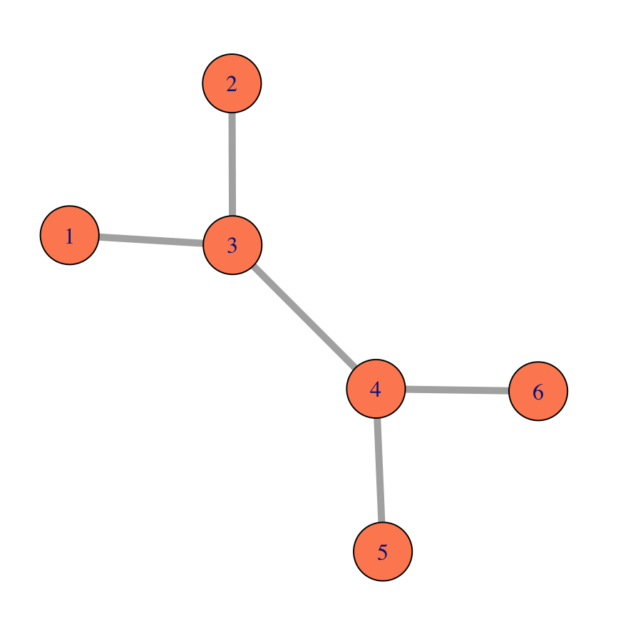
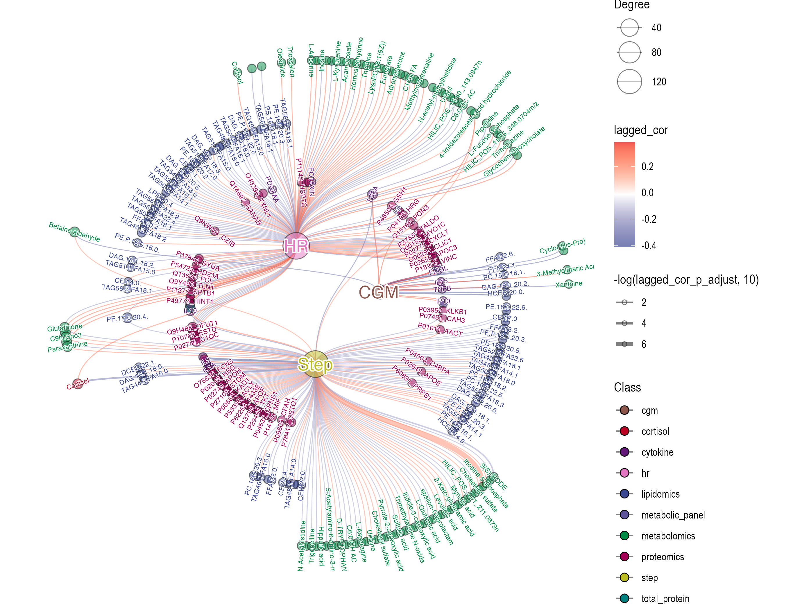

layout: true
background-image: url(lkc_logo.png)
background-position: 100% 0%
background-size: 20%
  
<div class="my-footer"><span>Xiaotao Shen/www.shen-lab.org</span></div> 

---


```{r setup, echo = FALSE, message = FALSE, warning = FALSE, include=FALSE}
knitr::opts_chunk$set(echo = FALSE, eval = FALSE, 
                      message = FALSE, cache = TRUE, dpi = 72)
library(tidyverse) # for data wrangling
```

```{r xaringan-themer, include = FALSE}
library(xaringanthemer)
# mono_dark(base_color = "green",
#           padding = 
#           background_color = "black",
#           text_color = "green",
#           link_color = "#eba134",
#           text_slide_number_color = "green",
#           inverse_background_color = "black",
#           inverse_text_color = "green",
#           inverse_header_color = "green",
#           header_font_family = google_font(family = "Lato"),
#           text_font_google = google_font(family = "Lato"),
#           code_font_google   = google_font("Droid Mono"),
#           header_h1_font_size = "30px", 
#           header_h2_font_size = "25px", 
#           header_h3_font_size = "20px",
#           text_font_size = "20px",
#           code_font_size = "1em",
#           table_border_color = "green",
#           table_row_border_color = "green", 
#           footnote_color = "green", 
#           footnote_font_size = "5px",
#           text_bold_color = "green",
#           header_color = "green"
#           )
mono_dark(base_color = "#cbf7ed", black_color = "white")
```

# About the class

-   **Instructor**: Xiaotao Shen (https://www.shen-lab.org/)

-   **Email**: xiaotao.shen@ntu.edu.stg

-   **WhatsApp**: +1 5712679283

-   **Github Repo**: https://github.com/jaspershen-lab/MD7115-NTU

-   **Reference**:

1.  [R for Data Science](https://r4ds.had.co.nz/)
2.  [R Graphics Cookbook](https://r-graphics.org/)
3.  [Network Analysis with R](https://www.amazon.com/Network-Analysis-R-Use/dp/3319238822)

---

# Introduction

In this course, we will learn how to use R to analyze and visualize data in the form of graphs, networks and trees. We will cover the following topics.

1.  What is a graph, network and tree?

2.  Their applications in biomedical research

3.  How to use R to analyze and visualize them

---

# Preparation

We need to install some R packages before the class.

Some packages are in Bionconductor, so we need to install `BiocManager` first.

```{r, echo=TRUE, eval = TRUE}
if (!requireNamespace("BiocManager", quietly = TRUE)){
install.packages("BiocManager")
}
```

---

# Preparation

`tidyverse` is a collection of R packages designed for data science, and it includes `ggplot2`, which is a basic graph package for network and tree in R.

```{r, echo=TRUE, eval = TRUE}
if (!requireNamespace("tidyverse", quietly = TRUE)){
install.packages("tidyverse")
}
```

---

# Preparation

Some specific packages for graph, network and tree analysis.

```{r, echo=TRUE, eval = TRUE}
if (!requireNamespace("igraph", quietly = TRUE)){
install.packages("igraph")
}
if(!requireNamespace("ggraph", quietly = TRUE)){
install.packages("ggraph")
}
```

---

# Preparation

Some specific packages for graph, network and tree analysis.

```{r, echo=TRUE, eval = TRUE}
if(!requireNamespace("tidygraph", quietly = TRUE)){
install.packages("tidygraph")
}
if(!requireNamespace("ggnetwork", quietly = TRUE)){
install.packages("ggnetwork")
}
```

---

# Preparation

Some specific packages for graph, network and tree analysis.

```{r, echo=TRUE, eval = TRUE}
if(!requireNamespace("ggtree", quietly = TRUE)){
BiocManager::install("ggtree")  
}
if(!requireNamespace("treeio", quietly = TRUE)){
BiocManager::install("treeio")  
}
if(!requireNamespace("ggtreeExtra", quietly = TRUE)){
BiocManager::install("ggtreeExtra")  
}
```

---

# What is a graph?

A graph is a collection of nodes (vertices) and edges (links) that connect pairs of nodes.

A small undirected graph with numbered nodes.



---

# Example 1



---

# Example 1

What's the network?

**Nodes**:

-   Wearable data: Step, HR, and CGM (continuous glucose monitoring) data

-   Omics data: Proteins, metabolites, and lipids

**Edges**:

-   Lagged correlations

-   Blue: negative correlations

-   Red: positive correlations


---

# Read the data

```{r, echo=TRUE, eval = TRUE}
# node data
if (!require(readr)) {
  install.packages("readr")
}
node_data <-
  readr::read_csv(
    "https://raw.githubusercontent.com/jaspershen-lab/MD7115-NTU/main/2_demo_data/example_node_data.csv"
  )
```

---

# Read the data

```{r, echo=TRUE, eval = TRUE}
#edge data
edge_data <-
  readr::read_csv(
    "https://raw.githubusercontent.com/jaspershen-lab/MD7115-NTU/main/2_demo_data/example_edge_data.csv"
  )
```

---

# Node data

```{r, echo=TRUE, eval = TRUE}
head(node_data)
```

---

# More references

1.  [Morden Statistics for Morden Biology](https://web.stanford.edu/class/bios221/book/10-chap.html#combining-phylogenetic-trees-into-a-data-analysis)

2.  [Network Analysis with R](https://www.amazon.com/Network-Analysis-R-Use/dp/3319238822)
